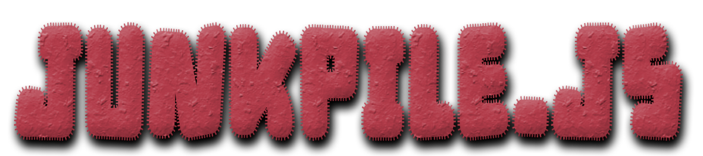

 

 Junkpile is a 2D JavaScript game engine I am working on. It came from the guts of a UI engine I am working on for <a href="http://www.hangbee.com/">HangBee</a>. This is a pet project of mine, and I hope to implement some ideas I have for browser games with it.

 
**[Documentation](https://derequa.github.io/Junkpile/)**
 
 
**Current Goals:**
- Integrate [Matter.js](http://brm.io/matter-js/) physics engine.
- Integrate [Sound.js](http://www.createjs.com/soundjs) audio library.
- Re-tool testing system and debug builds.
- Add documentation reporting via [Inch-CI](http://inch-ci.org/).
- Add build status and test result reporting via [Travis-CI](https://travis-ci.org/)
- Implement a test/demo Pong game.

